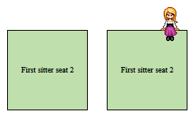

# Javascript "screensitter"



Automatically position an image on the upper right corner of a block element on hover and touchstart.

Howto: include the script and use the following snippet to create a sitter.

````
<script>
    window.addEventListener("load",function(event) {
        new MpScreensitter(
            {
                seat_class: 'sit_here', // The class of the elements to target (default: "seat")
                sitter_class: 'sitter', // The class of the sitter image (default: "sitter")
                
                // A list of the possible sitters. One will be selected at random the target box changes.
                sitter_images: [
                    './sitter.gif',
                    './sitter2.gif',
                ],
                sitter_offset_x: 10, // Distance from the right side of the box in pixels
                sitter_offset_y: 14, // Vertical offset in pixels. The "legs'" size.
            }
      
    },false);
</script>
````

Notes:

* You can have multiple sitters as long as they target a different class.
* The target elements cannot be inline elements.
